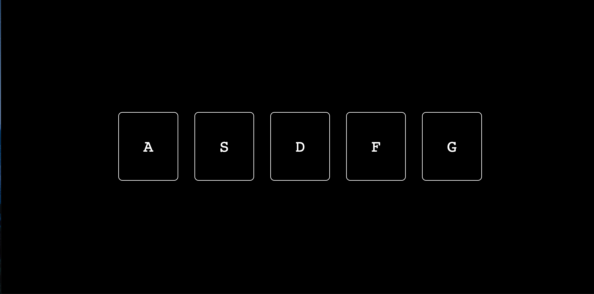

# Vanilla JS Keyboard Drumkit

## Overview
Keyboard drum kit based on the Javascript30 course
In this project, I learned how to use key events and data attributes.

## Try it
https://keyboard-drum-kit-git-master.nonowelle.vercel.app/
